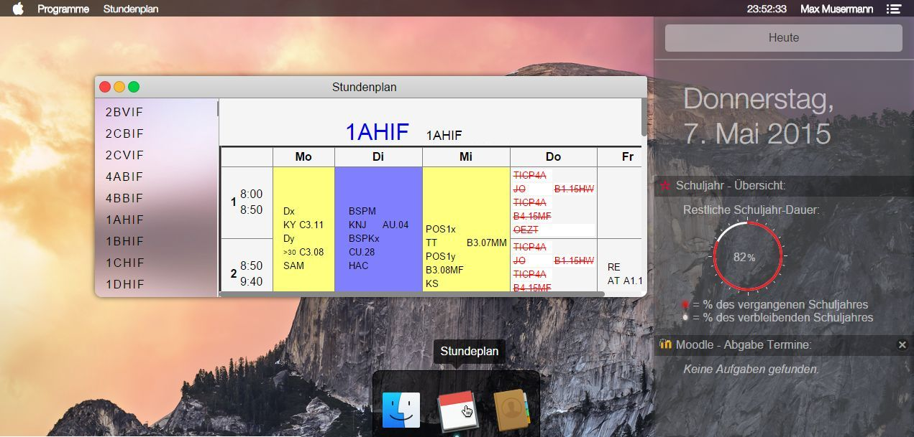

# VDesktop

**VDesktop** – *The practical virtual computer. In the browser. Simple and reliable.*

---

## 🧭 Project Overview

VDesktop is a web-based desktop interface that runs entirely in the browser.  
It was designed to offer a familiar, OS-like experience with useful small tools for quick and intuitive use by both students and teachers.

---

## 🏫 Origin

This project was originally created as a **school project** by class **4AHIF of HTL Spengergasse** during the academic year **2014/2015**.

> The goal was to support both students and teachers with lightweight, easy-to-use browser tools – without installation, available anywhere.

---

## 🚨 Login Information

**👉 Default login on the demo page is: `admin` / `admin`**
[demo page](https://vdesktop.manuelweb.at/desktop.php)

---

## 💻 Technologies Used

This project was built using:

- **PHP** (server-side logic)
- **jQuery**
- **jQuery Easing**
- **easyPieChart**

- **XP-style Error Message Easter Egg**  
  from [this Windows XP CodePen by N19](https://codepen.io/N19/pen/ZYrrrN)

- **Window Management Concept**  
  from [this draggable windows CodePen by Keubix](https://codepen.io/Keubix/pen/LEeXQr) (used as conceptual basis for multi-window interaction)

- **iOS Clear Notifications Button in CSS**  
  from [Adrian Osmond's CodePen](https://codepen.io/adrianosmond/pen/ALjgev)

---

## 🧪 Project Status

This project has been lightly updated to remain runnable for demonstration purposes. 
It should be viewed as a project of its time (2014/2015) and is not actively maintained or developed further. Nevertheless, it got refactored 2025 to be fully finished as it was intended to look alike.

---

## 🚀 Newer Projects

For modern and production-grade web, automation, or software engineering projects, check out my current repositories:

🔗 [https://github.com/manuelhintermayr](https://github.com/manuelhintermayr)

---

## ⚖️ License

This project is released under the **MIT License**.  
See the [`LICENSE`](./LICENSE) file for details.

---

## 📜 Legal Disclaimer

> **Disclaimer:**  
> This is a fan-made project created for educational and demonstration purposes only.  
> This site/project/repo and its contents are not endorsed, associated or affiliated with Apple Computers, Inc.©
> All trademarks, logos, and brand names such as "macOS", "Mac", "Finder", and the Apple logo are the property of Apple Inc.  
> Icons and designs resembling Apple's intellectual property are used under fair use for non-commercial and illustrative purposes.  
> If you are a representative of Apple Inc. and would like any material to be removed or modified, please contact me and I will comply immediately.

---

Made with ❤️ by [Manuel Hintermayr](https://manuelhintermayr.com)
